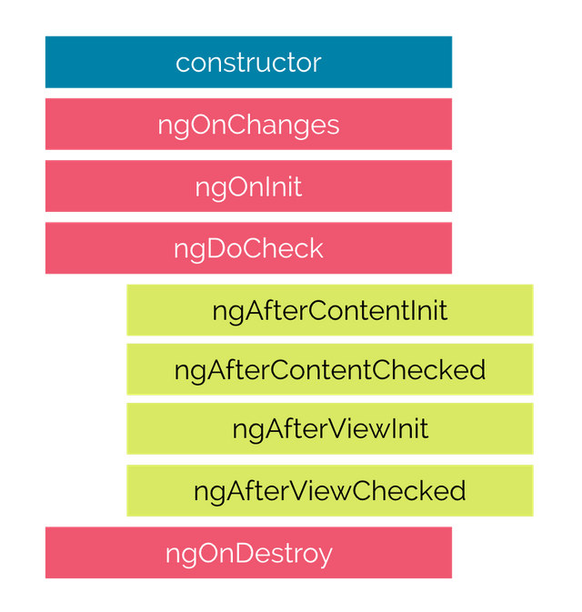
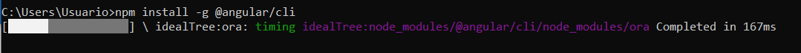
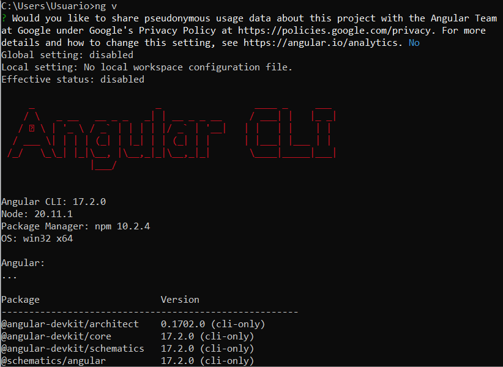
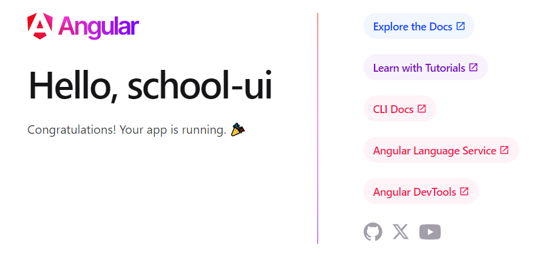
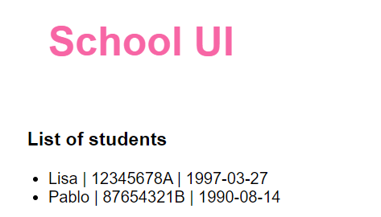
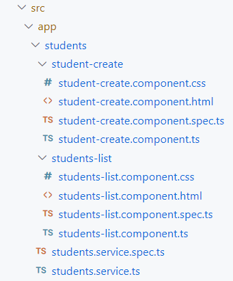
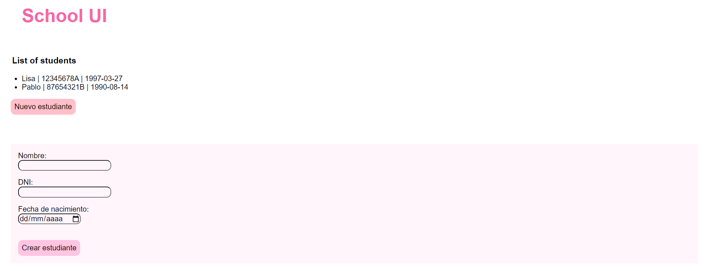

# Práctica 7: Introducción a Angular

En esta práctica vamos a realizar una interfaz básica para comunicarnos con nuestros microservicios usando **Angular**. 
Usaremos la última versión LTS de Angular, la **17.2**.

### Introducción

Angular es un framework JavaScript de código abierto, mantenido por Google, que se utiliza para construir aplicaciones web modernas y escalables. Se basa en TypeScript, un superconjunto de JavaScript que añade características como tipado estático y clases.

#### Elementos principales

- **Componentes**: Los componentes son los bloques de construcción básicos de las aplicaciones Angular. Son piezas independientes y reutilizables de código que encapsulan la lógica, la presentación y el estilo de una parte de la aplicación.
- **Módulos**: Los módulos son unidades de organización que agrupan componentes, servicios y otros módulos relacionados.
- **Plantillas**: Las plantillas son archivos HTML que se utilizan para definir la estructura y el contenido de la interfaz de usuario de un componente.
- **Directivas**: Las directivas son atributos especiales que se pueden agregar a los elementos HTML para modificar su comportamiento o apariencia.
- **Servicios**: Los servicios son clases que encapsulan la lógica de negocio de la aplicación. Se pueden inyectar en los componentes para acceder a su funcionalidad.


#### Angular CLI

La **CLI** de Angular es una herramienta de línea de comandos que se utiliza para crear, construir y ejecutar aplicaciones Angular. Proporciona una serie de comandos que te ayudan a realizar tareas comunes, como:

- Crear nuevos proyectos
- Generar componentes, módulos y servicios
- Compilar y ejecutar la aplicación
- Probar la aplicación
- Implementar la aplicación en producción


#### Ciclos de vida

Los ciclos de vida en Angular definen las diferentes etapas por las que atraviesa un componente desde su creación hasta su destrucción. Los **hooks** permiten ejecutar código en momentos específicos del ciclo de vida de un componente. Los hooks más relevantes son los siguientes:

- ngOnChanges: Se ejecuta cada vez que se detecta un cambio en un input binding del componente. Es útil para actualizar la lógica del componente en función de los cambios en las propiedades de entrada.

- **ngOnInit**: Se ejecuta una sola vez, después de que se ejecuta el hook ngOnChanges. Es el lugar ideal para realizar tareas de inicialización del componente, como obtener datos o configurar el DOM.

- **ngDoCheck**: Se ejecuta después de que se detecta un cambio en las propiedades del componente o en sus hijos. Es útil para realizar comprobaciones personalizadas y actualizar el DOM si es necesario.

- **ngAfterViewInit**: Se ejecuta después de que la vista del componente ha sido renderizada por completo. Es útil para realizar tareas que dependen del DOM renderizado, como manipular elementos o agregar estilos.

- **ngOnDestroy**: Se ejecuta justo antes de que el componente sea destruido. Es útil para liberar recursos, como cancelar suscripciones o eliminar elementos del DOM.

Todos los hooks pueden visualizarse en el siguiente diagrama:


#### Angular 17

Angular 17 es la última versión del framework. Se lanzó en septiembre de 2023 e incluye una serie de mejoras y cambios importantes, como:

- **Standalone components**: Esta es la mayor novedad de Angular 17. Los componentes standalone son una nueva forma de crear componentes que no necesitan estar dentro de un módulo. Esto hace que los componentes sean más fáciles de crear, usar y compartir.
- **Mejoras en el rendimiento**: Angular 17 incluye una serie de mejoras en el rendimiento que hacen que las aplicaciones Angular sean más rápidas y receptivas. Estas mejoras incluyen:
    - Un nuevo compilador más rápido
    - Un nuevo motor de renderizado más eficiente
    - Detección de cambios más granular
- **Soporte para TypeScript 4.7**: Angular 17 ahora es compatible con TypeScript 4.7, que incluye una serie de nuevas características y mejoras.


#### NgModules vs Standalone Components
En Angular, existen dos formas principales de organizar y estructurar el código: NgModules y Standalone Components. Cada uno tiene sus propias ventajas y desventajas.

- **NgModules**:
    - Son unidades de organización que agrupan componentes, servicios y otros módulos relacionados.
    - Se utilizan para definir la configuración de la aplicación, como las importaciones y exportaciones de módulos, los proveedores de servicios y las declaraciones de componentes.
    - Son una parte fundamental de la arquitectura de las aplicaciones Angular tradicionales.

Un ejemplo de código en Angular usando NgModules es el siguiente:

```
@NgModule({
  declarations: [
    AppComponent,
    HomeComponent,
    AboutComponent,
  ],
  imports: [
    BrowserModule,
    FormsModule,
  ],
  providers: [
    MyService,
  ],
  bootstrap: [AppComponent]
})
export class AppModule {}
```

- **Standalone Components**:
    - Son una nueva característica de Angular 17 que permite crear componentes sin necesidad de un módulo.
    - Esto hace que los componentes sean más fáciles de crear, usar y compartir.
    - Los componentes standalone se pueden importar directamente en cualquier módulo de la aplicación.

Un ejemplo de código en Angular usando Standalone Component es el siguiente:

```
@Component({
  selector: 'my-component',
  templateUrl: './my-component.component.html',
  styleUrls: ['./my-component.component.css']
})

export class MyComponent {
  constructor(private myService: MyService) {}
}
```
### Instalación

Para instalar Angular necesitamos tener instalado Node.js en nuestro sistema. Podemos descargarlo desde aquí: https://nodejs.org/en

📢 Esta práctica será realizada usando Node.js en la versión 20.11.1.

💡 Para verificar si Node.js está correctamente instalado, lanza el comando `node -v`. Si te devuelve la versión de Node que hay en tu sistema, la instalación se realizó correctamente.

Tras ello, basta con seguir los siguientes pasos:
1. Si estamos en Windows, primero necesitamos activar la ejecución de scripts de PowerShell mediante el comando `Set-ExecutionPolicy -Scope CurrentUser -ExecutionPolicy RemoteSigned`
2. Lanzamos el comando `npm install -g @angular/cli` y esperamos a que termine la instalación.



3. Cuando termina la instalación, comprobamos que se ha realizado correctamente lanzando el comando `ng v`:




### Creación de school-ui

Para nuestro ejemplo vamos a crear una interfaz llamada School UI que se comunicará con nuestros microservicios. Seguimos los siguientes pasos:

1. Para crear un nuevo proyecto de Angular, ejecutamos el comando `ng new school-ui`. Este comando crea una nueva carpeta desde el lugar donde se ejecuta el comando, con un proyecto básico de Angular. Durante su creación nos pregunta algunas configuraciones para el proyecto, en cuyo caso basta con pulsar Enter para que tome las configuraciones por defecto.

2. Cuando termina la instalación, pasamos a lanzar el proyecto con los comandos `cd school-ui` y `ng serve --open`. Por defecto se lanzará la interfaz en `localhost:4200`. Si accedemos a esa dirección, deberíamos ver la siguiente pantalla:



### Creación de students-list component

Vamos a pasar a crear un componente que mostrará la lista de estudiantes que existen en nuestra base de datos. Para ello, seguimos los siguientes pasos:

1. Creamos un nuevo componente mediante el comando `ng generate component students-list`. Este comando genera 4 ficheros:
- **students-list.component.css**: Hoja de estilos que será aplicada de forma única a nuestro componente. 
- **students-list.component.html**: Fichero HTML que contendrá la maquetación y el diseño del componente.
- **students-list.component.spec.ts**: Fichero de tests del componente.
- **students-list.component.ts**: Fichero de configuración del componente, donde además se encontrará su lógica.

2. Ya que realizaremos una llamada HTTP a la API que expusimos en students-service, vamos a generar un servicio que se encargue de ello. Esta lógica podría añadirse directamente en el componente, pero es una buena práctica extraer este tipo de funciones a un servicio.
Para crear el servicio ejecutamos el comando `ng generate service students`. Este comando genera dos ficheros:
- **students.service.spec.ts**: Fichero que contendrá los tests del servicio.
- **students.service.ts**: Servicio en sí, que contendrá toda su lógica y deberá ser importado en los componentes que lo usen.

3. En el servicio añadimos la llamada al método `GET /students` del siguiente modo:

```
import { Injectable } from '@angular/core';
import { HttpClient } from '@angular/common/http';
import { Observable } from 'rxjs';

@Injectable({
  providedIn: 'root'
})
export class StudentsService {

  private readonly API_URL = 'http://localhost:8081/students';

  constructor(private readonly http: HttpClient) {}

  getStudents(): Observable<any> {
    return this.http.get(this.API_URL);
  }
}
```

Tras ello, añadimos la llamada a este método a la función onInit del componente:

```
import { Component } from '@angular/core';
import { StudentsService } from '../students.service';
import { CommonModule } from '@angular/common'; // lo necesitamos para poder usar la instrucción NgFor

@Component({
  selector: 'app-students',
  standalone: true,
  imports: [CommonModule],
  templateUrl: './students-list.component.html',
  styleUrl: './students-list.component.css'
})
export class StudentsComponent {

  students: any[] = [];

  constructor(private readonly studentsService: StudentsService) {}

  ngOnInit(): void {
    this.studentsService.getStudents()
      .subscribe(data => {
        this.students = data;
      });
  }
}
```

4. Para terminar con la configuración del componente, basta con modificar la plantilla con el siguiente código para que muestre en una lista todos los estudiantes:

```
<h3>List of students</h3>

<ul>
    <li *ngFor="let student of students">
        {{ student.name }} | {{ student.dni }} | {{ student.birthDate }}
    </li>
</ul>
```

5. Si volvemos a `localhost:4200`, veremos que aún no se muestra la lista de estudiantetes. Esto es debido a que hemos configurado el componente, pero aún no lo estamos usando. Para este ejemplo vamos a colocar nuestro componente en el componente principal del proyecto, el **App Component** que está alojado en los ficheros **app.component.ts/html**.
Para usar el componente students-list en el componente principa, nos vamos a **app.component.html** y sustituimos todo el componente por el siguiente snippet:

```
<h1>{{title}}</h1>
<app-students></app-students>
```

6. Ahora sí, si volvemos al navegador veremos que ya se muestra la lista de estudiantes:



💡 Si te fijas, en tu navegador aparece como h1 el texto *school-ui* en lugar de **School UI**, como en la captura. ¿Qué hay que cambiar para que cambie este valor? Analiza el proyecto y realiza el cambio correspondiente.


### Creación de student-create component

Ya tenemos el ejemplo de como realizar un GET y mostrar su resultado. Ahora vamos a realizar un nuevo componente con el que crearemos nuevos estudiantes, realizando para ello la petición ´POST /student´:

1. Generamos un nuevo componente, nuevamente con la CLI de Angular mediante el comando `ng generate component student-create`.

✨ En este punto el directorio de ficheros se vuelve un poco caótico. Como parte de las buenas prácticas, deberíamos ordenarlo para hacer los componentes fácilmente localizables. Por ejemplo, podemos crear una carpeta **students** que contenga los dos nuevos componentes y el servicio que creamos antes, de modo que tendremos en una única carpeta todo aquello referente a los estudiantes:



2. Añadimos la función para llamar al POST en nuestro servicio:

```
import { Injectable } from '@angular/core';
import { HttpClient } from '@angular/common/http';
import { Observable } from 'rxjs';

@Injectable({
  providedIn: 'root'
})
export class StudentsService {

  private readonly API_URL = 'http://localhost:8081/students';

  constructor(private readonly http: HttpClient) {}

  getStudents(): Observable<any> {
    return this.http.get(this.API_URL);
  }

  createStudent(student: any) {
    return this.http.post(this.API_URL, student);
  }
}
```

3. Modificamos el componente student-create para permitir la creación y realizar la llamada al método del servicio:

**student-list.component.html**
```
<form (ngSubmit)="onSubmit()">
    <label for="name">Nombre:</label>
    <input type="text" id="name" name="name" [(ngModel)]="student.name" required>

    <label for="dni">DNI:</label>
    <input type="text" id="dni" name="dni" [(ngModel)]="student.dni" required>

    <label for="birthDate">Fecha de nacimiento:</label>
    <input type="date" id="birthDate" name="birthDate" [(ngModel)]="student.birthDate" required>

    <button type="submit">Crear estudiante</button>
</form>
```

**student-list.component.ts**
```
import { Component } from '@angular/core';
import { StudentsService } from '../students.service';
import { CommonModule } from '@angular/common';
import { FormsModule } from '@angular/forms'; // necesario para el two way binding

@Component({
  selector: 'app-student-create',
  standalone: true,
  imports: [CommonModule, FormsModule],
  templateUrl: './student-create.component.html',
  styleUrl: './student-create.component.css'
})

export class StudentCreateComponent {
  constructor(private readonly studentsService: StudentsService) {}

  student = {
    name: '',
    dni: '',
    birthDate: ''
  };

  onSubmit() {
    this.studentsService.createStudent(this.student).subscribe(() => {
      // Show success msg
    });
  }
}
```

4. Al igual que antes, ahora nos falta mostrar este componente para poder usarlo. Sin embargo, esta vez no queremos que se renderice directamente, sino que queremos añadir un botón que nos lleve al formulario. Para ello, usaremos el **routing** de angular. Vamos al archivo **app.routes.ts** y añadimos la ruta para nuestro componente del siguiente modo:

```
import { Routes } from '@angular/router';
import { StudentCreateComponent } from './students/student-create/student-create.component';

export const routes: Routes = [
    { path: 'create-student', component: StudentCreateComponent }
];
```

Tras ello, modificamos nuevamente el **app.component.html** para añadir un botón que nos redirija al componente, y también el módulo de routing:

```
<h1>{{title}}</h1>
<app-students></app-students>

<button routerLink="create-student">
    Nuevo estudiante
</button>

<router-outlet></router-outlet> 
```

5. Si vamos a `localhost:4200` y pulsamos el botón, podremos visualizar el formulario:



Para comprobar que funciona, creamos un nuevo estudiante y refrescamos para comprobar si aparece en el listado.


💡 Realiza los cambios necesarios para que tras crear cada estudiante, **se muestre un mensaje de éxito o de error** según cada caso.

💡 ¿Necesitamos refrescar siempre para ver los cambios? **Investiga como hacer que el listado se actualiza automáticamente** e impleméntalo.

### Borrado y edición de estudiantes

Repite los pasos para tener en la UI las opciones de eliminar y editar los estudiantes del listado. 

## Bibliografía
- https://angular.io/docs
- https://blog.angular.io/introducing-angular-v17-4d7033312e4b
- https://blogs.halodoc.io/angular-standalone-components-unleashed-exploring-the-magic-of-a-world-without-ngmodule/